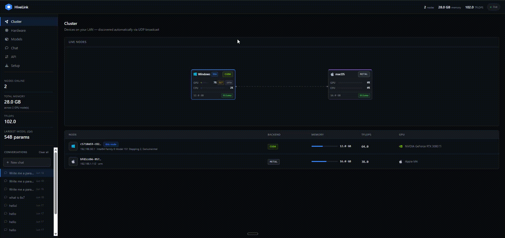
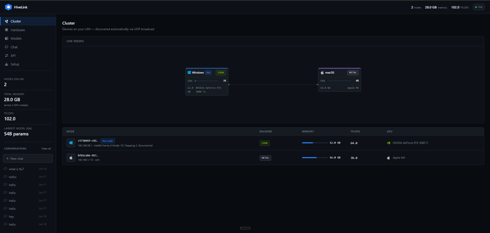
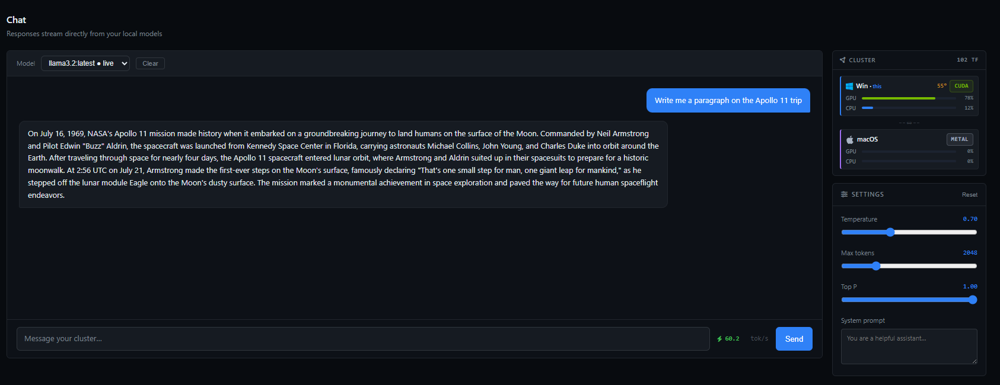

<div align="center">

<!-- ── HERO IMAGE GOES HERE ── -->


<h1>HiveLink</h1>

<p><strong>Pool your Mac, Windows, and Linux machines into one AI cluster.<br/>Run models too big for any single device — no cloud, no config, no nonsense.</strong></p>

[](https://python.org)
[](LICENSE)
[](https://github.com/Kikobuf/hivelink)
[](https://github.com/ggerganov/llama.cpp)

<!-- ── DEMO GIF GOES HERE ── -->


</div>

---

## What is HiveLink?

HiveLink splits large language models across every machine on your LAN so you can run models that don't fit on any single device. Your RTX 3080 Ti handles some layers, your Mac mini handles the rest — they work together as one cluster.

- **Zero config** — nodes find each other automatically via UDP broadcast
- **Mixed hardware** — NVIDIA, AMD, Apple Silicon, and CPU nodes all work together
- **OpenAI-compatible API** — drop-in replacement, works with any existing client
- **Live dashboard** — EXO-style cluster viz with real-time GPU%, temperature, and wattage
- **Built on llama.cpp** — same GGUF format everywhere, full CUDA/ROCm/Metal support

> **Think EXO, but it actually works on Windows and NVIDIA.**

---

## Quick start

```bash
# Install
pip install hivelink
pip install "hivelink[nvidia]"   # NVIDIA GPU
pip install "hivelink[amd]"      # AMD GPU

# Run on every machine — they find each other automatically
hivelink start

# If machines are on different subnets, use static peers
hivelink start --peer 192.168.1.112
```

Open **http://localhost:47730** — your cluster dashboard appears instantly.

---

## Dashboard

<!-- ── DASHBOARD SCREENSHOT GOES HERE ── -->


The dashboard shows every node with live stats updating every 2 seconds:

- **GPU utilization bar** — green, live
- **Temperature** — amber badge (NVIDIA; Apple Silicon in v0.5)
- **Power draw** — wattage per GPU
- **CPU utilization** — all nodes
- **Engine detection** — Ollama, MLX, vLLM, or llama-server badge auto-appears
- **Dashed arrows** between nodes showing the pipeline data flow

---

## Chat

<!-- ── CHAT SCREENSHOT GOES HERE ── -->


Built-in chat at `http://localhost:47730` — no separate Open WebUI needed:

- Streaming responses with tok/s counter
- **Mini cluster panel** — live node stats visible while you chat
- Conversation history saved in browser localStorage
- Temperature, max tokens, top P, and system prompt controls
- Chain-of-thought display for reasoning models (DeepSeek-R1, etc.)

---

## Supported hardware

| Platform | OS | Backend | Status |
|---|---|---|---|
| 🍎 Apple Silicon Mac | macOS 12+ | Metal | ✅ Full support |
| 🪟 Windows (NVIDIA) | Windows 10/11 | CUDA | ✅ Full support |
| 🪟 Windows (AMD) | Windows 10/11 | ROCm | ✅ Full support |
| 🐧 Linux (NVIDIA) | Ubuntu 22+ | CUDA | ✅ Full support |
| 🐧 Linux (AMD) | Ubuntu 22+ | ROCm | ✅ Full support |
| 💻 CPU-only node | Any | CPU | ✅ Supported |

---

## How it works

HiveLink uses **pipeline parallelism** — transformer layers are split sequentially across nodes. Each machine processes its chunk and passes activations to the next node in the pipeline.

```
Prompt ──▶ [Windows · RTX 3080 Ti]  layers 0–31  (CUDA)
                        │
                        ▼ activations over LAN
           [Mac mini · M4]           layers 32–79 (Metal)
                        │
                        ▼
                    Response
```

Layer assignment is weighted by `√VRAM × log(TFLOPS)` — more capable nodes get more layers. All nodes use **llama.cpp** with GGUF models — no format conversion between nodes.

---

## Supported models

Any GGUF model works. Known models get automatic memory feasibility checking:

| Model | Params | Min VRAM (Q4) |
|---|---|---|
| llama3.2 | 3B | 2 GB |
| llama3-8b | 8B | 5 GB |
| llama3-70b | 70B | 40 GB |
| llama3-405b | 405B | 230 GB |
| qwen2.5-7b | 7B | 4 GB |
| qwen2.5-32b | 32B | 18 GB |
| qwen2.5-72b | 72B | 41 GB |
| mistral-7b | 7B | 4 GB |
| mixtral-8x7b | 47B | 26 GB |
| deepseek-r1-7b | 7B | 4 GB |
| gemma2-9b | 9B | 5 GB |
| gemma2-27b | 27B | 15 GB |

---

## OpenAI-compatible API

```python
from openai import OpenAI

client = OpenAI(
    base_url="http://localhost:47730/v1",
    api_key="hivelink",
)

response = client.chat.completions.create(
    model="llama3.2:latest",
    messages=[{"role": "user", "content": "Hello!"}],
    stream=True,
)

for chunk in response:
    print(chunk.choices[0].delta.content or "", end="")
```

Works with **LangChain**, **LlamaIndex**, **Open WebUI**, **SillyTavern**, **Cursor**, and any OpenAI-compatible client.

---

## CLI

```
hivelink start                     Start this node (joins cluster automatically)
hivelink start --peer 192.168.1.x  Start with a static peer (cross-subnet)
hivelink status                    Show all nodes in the cluster
hivelink models                    List models the cluster can run
hivelink plan llama3-70b           Show layer distribution plan
hivelink hardware                  Detect this machine's hardware
```

---

## Networking

### Same LAN (default)
Plug both machines into your router — nodes find each other automatically via UDP broadcast.

### Different subnets
```bash
# Windows
hivelink start --peer 192.168.1.112

# Mac
hivelink start --peer 192.168.1.115
```

### Connection speed

| Connection | Bandwidth | Notes |
|---|---|---|
| WiFi (5 GHz) | ~300 Mbps | Fine for 7B–13B models |
| Gigabit Ethernet | ~940 Mbps | Recommended for 70B+ |
| Thunderbolt bridge | ~9,000 Mbps | Best for side-by-side machines |

### Auto-start on Mac

```bash
cat > ~/Library/LaunchAgents/com.hivelink.plist << 'EOF'
<?xml version="1.0" encoding="UTF-8"?>
<!DOCTYPE plist PUBLIC "-//Apple//DTD PLIST 1.0//EN" "http://www.apple.com/DTDs/PropertyList-1.0.dtd">
<plist version="1.0">
<dict>
    <key>Label</key><string>com.hivelink</string>
    <key>ProgramArguments</key>
    <array>
        <string>/usr/local/bin/hivelink</string>
        <string>start</string>
        <string>--peer</string>
        <string>YOUR_WINDOWS_IP</string>
    </array>
    <key>RunAtLoad</key><true/>
    <key>KeepAlive</key><true/>
</dict>
</plist>
EOF
launchctl load ~/Library/LaunchAgents/com.hivelink.plist
```

---

## Architecture

```
hivelink/
├── hardware.py     Hardware detection — NVIDIA/AMD/Apple Silicon/CPU
├── discovery.py    UDP broadcast + static peer discovery
├── scheduler.py    Layer assignment weighted by VRAM × compute
├── stats.py        Live stats — GPU util%, temp, wattage via nvidia-smi + psutil
├── server.py       FastAPI — REST, WebSocket, OpenAI-compatible API
└── cli.py          CLI with --peer flag for cross-subnet setups

dashboard/
└── index.html      Self-contained dashboard — no build step, no npm
```

---

## Why not EXO?

| | HiveLink | EXO |
|---|---|---|
| Windows support | ✅ Full | ❌ Not supported |
| NVIDIA CUDA | ✅ Full | ⚠️ Buggy (reports 0 TFLOPS) |
| AMD ROCm | ✅ Supported | ❌ Not supported |
| Model format | GGUF (universal) | MLX + tinygrad (Mac-only) |
| Mixed backends | ✅ CUDA + Metal together | ❌ Throughput loss |
| Live stats | ✅ GPU%, temp, wattage | ✅ GPU%, temp, wattage |
| Built-in chat | ✅ Yes | ✅ Yes |

---

## Roadmap

- [x] v0.1 — UDP discovery, pipeline parallelism, OpenAI API, dashboard
- [x] v0.2 — Live GPU/CPU stats, EXO-style viz, mini cluster in chat, static peers
- [ ] v0.3 — `hivelink pull <model>`, model streaming across nodes
- [ ] v0.4 — Sharding controls (pipeline vs tensor), instances, minimum nodes
- [ ] v0.5 — Native installers (Windows `.exe`, macOS `.dmg`, Linux AppImage)
- [ ] v0.6 — Vision model support, file uploads in chat
- [ ] v0.7 — Cross-network via Tailscale

---

## License

MIT — see [LICENSE](LICENSE)
